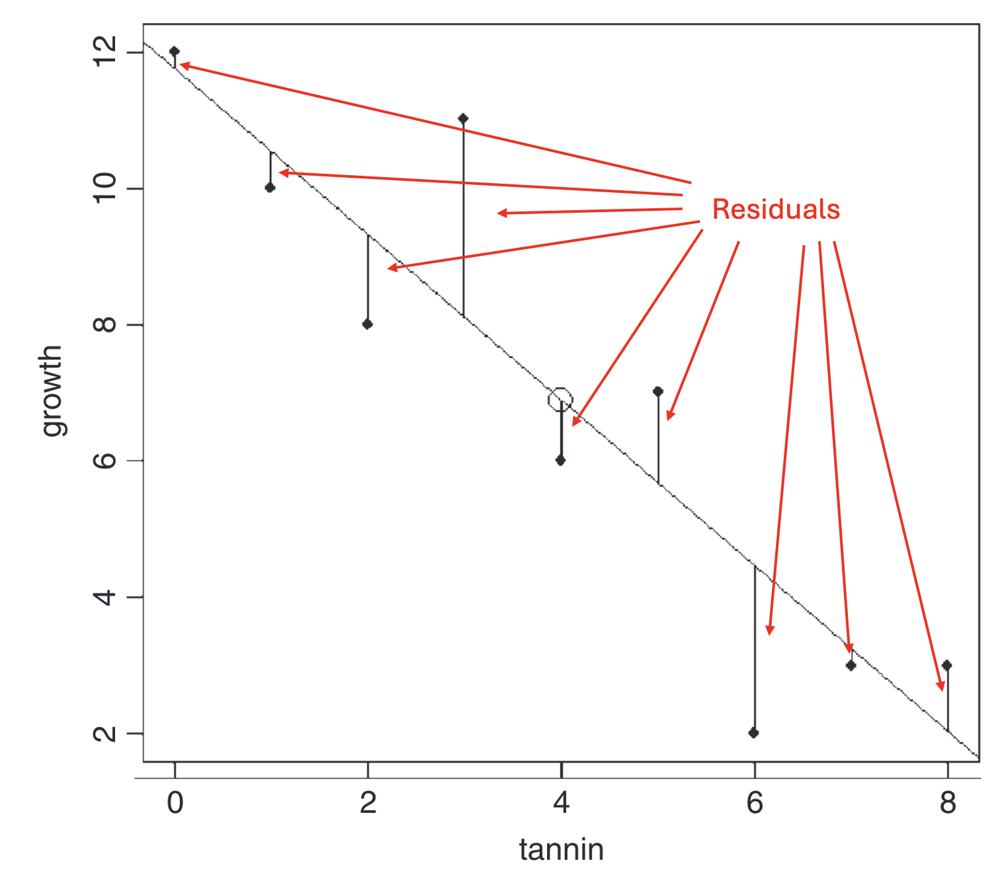

A regression analysis is used when you are interested in a causal relationship between two continuous variables. The one you are interested in explaining, which is on the y-axis of a graph, is called the **response variable** (or dependent variable), while the variable used to explain it is called the predictor (or independent variable) and makes up the x-axis.

The simplest type of regression is a **linear regression**. Once you have mastered linear regression, it can easily be extended to also study non-linear relationships, different regression lines for different groups, and even more advanced relationships.

**A linear regression has the following requirements for the data**

-   that the variance in the response variable is constant
-   that the predictor is estimated without error (we generally assume this to be the case)
-   that the residuals are normally distributed

**Residual** A residual is the difference between a measured value of the response variable and the predicted value of the response variable if it had been placed exactly on the regression line. The further a point lies from the line (in the y-direction), the larger the residual.

{fig-align="left" width="400"}

## Load the data

We want to investigate the reproduction of a plant. To do this, we have measured the height of 20 plants, and we have also counted how many seeds each plant has. Now we want to find out whether the number of seeds depends on the height of the plants.

Download the following file [plant_reproduction.txt](data/plant_reproduction.txt) (right-click, choose "Save link as") and save the file on your hard drive in a folder with a suitable name.

Continue by reading in the dataset and giving it a name — in this case we call it `plant_reproduction_data`. A detailed description of how to read in files can be found in our earlier tutorial [Reading data into R](https://martin-lind.github.io/Introduktion-till-R/tutorials/read-data/#l%C3%A4s-in-filen).

**Don't forget to document your code in a script,** with comments explaining what you are doing! [See our tutorial on scripts](https://martin-lind.github.io/Introduktion-till-R/tutorials/use-R/#anv%C3%A4nda-scriptfiler) if you need a reminder of how to create and use scripts.

```{r}
#| code-fold: false

plant_reproduction_data <- read.table("data/plant_reproduction.txt",
                           header=T,
                           sep="\t",
                           dec=",") 
```

`<-` means that we save the result of the function (in this case `read.table()`) in an object. The arrow points to the object, and we give the object a name, in this case `plant_reproduction_data`.

`read.table` is the command for reading in text files with the `.txt` extension

`"data/plant_reproduction.txt"` is the path to the location where the data file is saved on your computer (`data/`), together with the name of the file (`plant_reproduction.txt`).

`header=T` means that the first row of the file contains the column headers, i.e. not values.

`sep="\t"` means that all values are separated by TAB.

`dec=","` means that a comma is used as the decimal separator (e.g. 1,32).

## Inspect the data

Start by looking at the structure of the data with `str()`.

```{r}
str(plant_reproduction_data)
```

`$ Seeds: int` means that the values in the column `Seeds` are *integers*

`$ Plant_height: int` means that the values in the column `Mass` are *integers*

If you have a column containing decimal numbers, it should say `num`. If instead it says `chr`, it means the data has a period as the decimal separator while you read it in with a comma as the separator (or vice versa), and R thinks it's text. Adjust the code and read in the data again (see our earlier tutorial [Reading data into R](https://martin-lind.github.io/Introduktion-till-R/tutorials/read-data/#l%C3%A4s-in-filen) for the adjusted code).

Then show the first five rows of your dataset with `head()` to check that everything looks correct

```{r}
head(plant_reproduction_data)
```

### Visualize the data with a simple graph

To make the graph we need to decide what should be on the x-axis and what should be on the y-axis. Which of the following statements is more logical?

A.  The size of the plant affects how many seeds it has

B.  The number of seeds a plant has affects its size

Option A is the more logical one. So it's the number of seeds that depends on the plant's size. Therefore we should have *number of seeds* (`Seeds`) on the y-axis, and the plant's size (`Plants_height`) on the x-axis.

We make a simple graph with the function `plot()` and then add a regression line with the function `abline()`. The graph is not publication-ready, but it gives us a quick overview of our data. We will go through how to make a publication-ready graph in the final part of our tutorial, under [Publication-ready figure].

```{r}
#| code-fold: false

plot(Seeds ~ Plant_height, data = plant_reproduction_data)
abline(lm(Seeds ~ Plant_height, data = plant_reproduction_data))
```

How do you interpret the graph? Does it look like the height of the plant affects the number of seeds it has?

## Statistical modeling

We now want to do a regression analysis to examine whether our response variable (dependent variable) `Seeds` depends on our explanatory variable (independent variable) `Plants_height`.

We specify a linear model using the function `lm()` and choose to save the result in an object we call `m.plant_reproduction`. I prefer that all my models (results of statistical tests) have a name starting with `m.` so that I know what is a dataset and what is a model. Always give your models descriptive names.

```{r}
#| code-fold: false

m.plant_reproduction<-lm(Seeds~Plant_height,
                    data=plant_reproduction_data)
```

In our model we have our response variable (what we have on the y-axis) to the left of the tilde sign `~` and our explanatory variable to the right. `data=plant_reproduction_data` means that we are using the dataset we previously named *plant_reproduction_data*.

### Statistical results

We start with an ANOVA table, using the function `anova()`

```{r}
#| code-fold: false

anova(m.plant_reproduction)
```

We get an ANOVA table and can inspect the result. We see that the p-value (here called `Pr(>F)`) is less than 0.05, i.e. `Plant_height` has a significant effect on `Seeds`. R also indicates significance by adding one or more stars `*`. When reporting p-values in writing, you give the p-value with three decimals, or "p \< 0.001" for very low p-values.

Is it a positive or negative effect of `Plant_height` on `Seeds`? To know that, we need to obtain the estimates of all the parameters in the model, i.e. where the line crosses the y-axis, and the slope of the line. For that we use the function `summary()`.

```{r}
#| code-fold: false

summary(m.plant_reproduction)
```

`Coefficients` gives us information about the coefficients. Feel free to compare with the figure you made above. `(Intercept)` is the value on the y-axis when the x-axis is zero, i.e. where the regression line crosses the y-axis. We see that it crosses the y-axis at `317.2300` and that the p-value (Pr(\>\|t\|)) is `3.08e-11`, i.e. less than 0.05, meaning the intercept is significantly different from zero. `Plant_height` is the slope of the regression line. It has the slope coefficient `3.7064`, and since it doesn't start with a minus sign, we know there is a positive relationship between `Plants_height` and `Seeds` (a plus sign is never printed)

**R-squared** describes how much of the variation in the data is explained by your statistical model. It can range from 0 (nothing explained) to 1 (everything explained). R gives you two values, namely `Multiple R-squared` and `Adjusted R-squared`. Use *Adjusted R-squared*, since it accounts for the number of parameters in the model.

## Presenting your statistical analysis

The number of seeds increased with increasing height of the plant (linear regression, F = 68.681, d.f. = 1 and 18, p \< 0.001, R<sup>2</sup> = 0.78).

You can phrase that sentence in many ways; one alternative is:

The taller the plant, the more seeds it has (linear regression, F = 68.681, d.f. = 1 and 18, p \< 0.001, R<sup>2</sup> = 0.78).

## Evaluate the statistical model

Was the model appropriate to use for your dataset?

We evaluate the model through *diagnostic plots* by using the function `plot()` on our statistical model.

```{r}
#| code-fold: false

plot(m.plant_reproduction)
```

We get four graphs to evaluate; the first two are the most important. You may need to press ENTER repeatedly to see all the graphs (in R they appear one at a time).

**Residuals vs Fitted** should show a fairly straight line. It shows how much the *residuals* (the difference in the y-direction between each value of your response and the regression line) deviate from the regression line. The residuals are shown as circles in the graph. If you see a pattern in the deviations, it means a straight regression line was not an appropriate statistical model.

**Normal Q-Q** shows whether the residuals are normally distributed. They should follow the diagonal dashed line. If they deviate in a systematic way, the residuals are not perfectly normally distributed, and we may need to change the model, for example by transforming the data.

**Scale-Location** illustrates whether the variation in the data is equal across all values. If the variation increases a lot toward the right (a common case), we have greater variation at higher values. This can be solved by transforming the data.

**Residuals vs Leverage** is used to find extreme values that have an abnormally large influence on the regression line. The pattern in the graph itself is not of interest — we are looking for values that lie outside the grey lines, especially the lines for **1**. Such values (outliers) should be double-checked, and you should consider whether they should be included in the dataset. Perhaps analyze both with and without the extreme values?

## Publication-ready figure

We finish by making a publication-ready figure, using the package **ggplot2**. If you don't already have the package installed, do so with the code `install.packages("ggplot2")`. Before using the package you need to load it into your R session with the function `library()`

### First - a simple plot with ggplot2

```{r}
#| code-fold: false

library(ggplot2)

plot.plant_reproduction.simple <- ggplot(plant_reproduction_data, aes(x = Plant_height, y = Seeds)) +
  geom_point() +
  geom_smooth(method = "lm", se = FALSE) +
  theme_classic()

plot.plant_reproduction.simple
```

Let's go through the code for our plot. It is spread over several lines, where each line ends with a `+` so that R understands the code continues on the next line.

`ggplot(plant_reproduction_data, aes(x = Plant_height, y = Seeds)) +` means we use the function `ggplot()`, and the first thing we specify is the name of our dataset, which we called `plant_reproduction_data`.

`aes()` is a function within ggplot; here we specify the aesthetics (`aes` stands for *aesthetics*). We specify the names of the variables that should be on the x-axis and y-axis respectively with `x = Plant_height, y = Seeds`.

`geom_point() +` means that we want each data point to become a point

`geom_smooth(method = "lm", se = FALSE) +` means that we add a linear regression line with `method = "lm"`, and we don't want standard errors, which we specify with `se = FALSE`. These are usually not included in graphs with regressions. If you still want the uncertainty shown in the graph, you can replace FALSE with TRUE.

`theme_classic()` is a theme for graphs. It is the theme that makes the graphs look the way we expect in scientific publications (white background, no gridlines, clean design). Note that it is the last line in our script, so it should not end with a plus sign.

### Publishable figure

It turned out fairly ok, but we can improve it.

1.  We want it to say "Plant height (cm)" on the x-axis, fixed with `xlab()`

2.  We want it to say "Number of seeds" on the y-axis, fixed with `ylab()`

3.  We want to choose blue points, and we want them to be a bit larger, fixed with `cex` and `color` within `geom_point()`

4.  We want the regression line to be black and dotted, fixed with `color` and `lty` (stands for line type) in `geom_smooth()`

```{r}
#| code-fold: false

plot.plant_reproduction <- ggplot(plant_reproduction_data, aes(x = Plant_height, y = Seeds)) +
  geom_point(cex = 3, colour = "blue") +
  geom_smooth(method = "lm", se = FALSE, lty = 3, color = "black") +
  xlab("Plant height (cm)")+
  ylab("Number of seeds")+
  theme_classic()

plot.plant_reproduction
```
