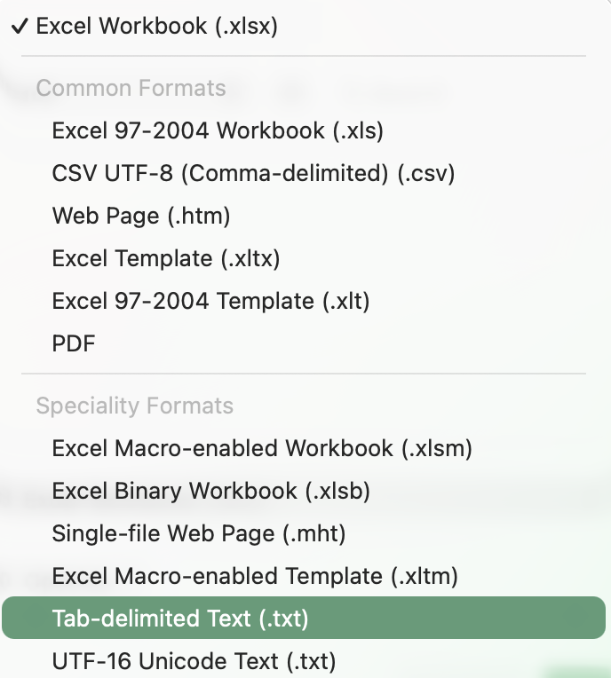

För att kunna analysera data måste vi ställa upp våra data på ett sätt som R accepterar. Vi skriver alltid in våra data i ett kalkylblad (exemperlvis Excel, Libreoffice, Numbers eller liknande) varefter vi exporterar vårt dataset till R.

## Namngivning

**Undvik mellanslag.** Vi vill inte använda oss av mellanslag i våra celler, då R tolkar mellanslag som att det är separata variablar. `Totalt Kol` är därmed ett dåligt namn, medan `Totalt_Kol` är ett bra namn.

**Undvik specialtecken.** Specialtecken kan ställa till det för R, eller för andra personer som skall analysera datasetet och inte har dina specialtecknen på sitt tangentbord. Från ett svenskt perspektiv innebär det att undvika Å, Ä och Ö. `Längd` är ett problematiskt namn, medan `Langd` är ett bra namn. Eller använd alltid engelska, eftersom det är standardspråket inom vetenskap (dvs skriv `Length`)

**Undvik väldigt långa namn.** När du gör statistik behöver du skriva in namnet på dina variablar i din kod. För att få en översiktlig kod och undvika att skriva fel är det en fördelen om namnen är korta, men ändå förklarar tydligt vad de beskriver. `Kroppslang_i_mm_fran_nabbspets_till_mittersta_stjartpennans_slut` är ett alldeles för långt namn, medan `Kroppslangd` är ett kort och bra namn. Beskrivningen av hur kroppslängd mätts är nödvändigt att skriva upp i din metodik, men behövs inte i ditt namn på variabeln.

## Långt format

R förväntar sig att ditt data är i **långt format** (*long format*, kallas ibland *tidy format*). Formatet utmärks av följande:

-   Varje kolumn är en variabel (något som grupperar ditt dataset eller något som du mätt)

-   Varje rad är ett prov (något som du mätt din responsvariabel i/på)

Nedan följer ett exempel på hur du skall lägga upp ett dataset, om du har mätt vikten på ett antal talgoxar och blåmesar

::: gridtable
|         |      |
|---------|------|
| Art     | Vikt |
| Talgoxe | 15,4 |
| Talgoxe | 16,9 |
| Talgoxe | 15,0 |
| Blames  | 9.9  |
| Blames  | 11,7 |
| Blames  | 10,5 |
:::

Som du ser är varje kolumn en separat variabel, den först är Art och den andra är Vikt. Likaså representerar varje rad en individ.

Du skall **INTE** lägga upp data på följande sätt:

::: gridtable
|                  |                 |
|------------------|-----------------|
| ~~Talgoxe.vikt~~ | ~~Blames.vikt~~ |
| ~~15,4~~         | ~~9.9~~         |
| ~~16,9~~         | ~~11,7~~        |
| ~~15,0~~         | ~~10,5~~        |
:::

I det här felaktiga exemplet ser du att variabeln Vikt är uppdelad på två kolumner. Likaså representerar inte varje rad en individ, utan det är två individer per rad.

### ID-kolumn

Du har ofta identifierat dina replikat på något sätt, det kan vara i olika akvarier som du numrerat, olika fågelindivider som du märkt med olika ringar, olika skogar med olika namn, eller olika provytor du inventerat i. För att veta vilken rad som motsvarar vilket prov i verkligheten brukar man även ha en kolumn som heter ID. Den används oftast inte i analyserna (såvida du inte mätt samma ID upprepade gånger över tid) men ID-kolumnen gör att du kan identifiera vilken rad som motsvarar vilket prov i verkligheten.

I exemplet nedan har vi räknat antal växtarter i kvadrater, som antingen finns på ängar där det bedrivs bete eller slåtter som skötselåtgärd.

::: gridtable
|     |               |          |
|-----|---------------|----------|
| ID  | Skotselatgard | Artantal |
| B1  | Bete          | 64       |
| B2  | Bete          | 55       |
| S1  | Slatter       | 76       |
| S2  | Slatter       | 50       |
:::

Notera att en unik kvadrat måste ha ett unikt ID. Vi kan inte kalla en kvadrat \`1\` i såväl betesmarken som slåtterängen, för då vet vi inte vilken av kvadraterna som ID \`1\` representerar. En enkel lösning är att ha med behandlingens namn som en del av det unika ID. I exemplet ovan så kallar vi den första kvadraten i betesmarken för B1 och den första kvadraten på slåtterängen S1.

### Mäta flera saker på samma prov?

Det är vanligt att vi mäter eller räknar flera saker på samma prov, då lägger vi till en ny kolumn för varje variabel vi har.

Vi kanske även har mätt längd hos fåglarna i exemplet ovan. Då lägger vi till en kolumn för längd.

::: gridtable
|               |         |      |       |
|---------------|---------|------|-------|
| ID_ringnummer | Art     | Vikt | Langd |
| 124577        | Talgoxe | 15,4 | 13,0  |
| 154386        | Talgoxe | 16,9 | 14,7  |
| 214522        | Talgoxe | 15,0 | 13,1  |
| 190084        | Blames  | 9.9  | 10,5  |
| 141687        | Blames  | 11,7 | 12,1  |
| 127750        | Blames  | 10,5 | 11,6  |
:::

### Flera mätningar av samma sak på samma prov över tid?

Om du mäter samma prov flera gånger, exempelvis över tid, skall du ha en variabel som representerar tidpunkt, och ditt prov skall ha en rad för varje mättillfälle. Här är ID-kolumnen viktig för analysen, den håller reda på att det är samma individ som mäts flera gånger.

I exemplet nedan har vi mätt höjden på två växter varje vecka.

::: gridtable
|         |       |      |
|---------|-------|------|
| ID      | Vecka | Hojd |
| Kruka_1 | 1     | 5    |
| Kruka_2 | 1     | 3    |
| Kruka_1 | 2     | 14   |
| Kruka_2 | 2     | 9    |
| Kruka_1 | 3     | 27   |
| Kruka_2 | 3     | 19   |
:::

### Saknas mätvärden?

Om du inte har alla värden är det viktigt att ange det. Till exempel kanske en av dina talgoxar flög iväg innan du hann mäta dess längd. Vad har den för längd då? Du skall inte skriva 0, för det betyder att du vet längden, och att den är 0 cm. Men du vet ju inte längden. Då fyller du istället i `NA`, vilket betyder *Not Available*, dvs att data saknas. R kan sedan tolka det som att data saknas.

::: gridtable
|               |         |      |       |
|---------------|---------|------|-------|
| ID_ringnummer | Art     | Vikt | Langd |
| 124577        | Talgoxe | 15,4 | 13,0  |
| 154386        | Talgoxe | 16,9 | NA    |
| 214522        | Talgoxe | 15,0 | 13,1  |
| 190084        | Blames  | 9.9  | 10,5  |
| 141687        | Blames  | 11,7 | 12,1  |
| 127750        | Blames  | 10,5 | 11,6  |
:::

## Exporera data från ditt kalkylprogram

När data är infört i ditt kalkylprogram måste du exportera det till ett format R kan läsa, till exempel till en `*.txt` -fil. För att det skall lyckas behöver du göra följande:

### Kalkylbladet skall enbart innehålla ditt dataset

Se till att din dataset börjar i cellen A1 (det är rubriken för din första kolumn) och att det inte finns några blankrader eller något annat (grafer, beräkningar av medelvärden eller liknande) i ditt kalkylblad. Är du osäker kan kopiera ditt data och klistra in det i ett nytt tomt kalkylblad innan export

### Välj exportformat

I Excel väljer du **File -\> Save as** och i rullgardinsmenyn för **File format** väljer du **Tab-delimited Text (.txt)**.

{width="300"}

Ignorera eventuella varningar från Excel och spara filen på lämplig plats på din hårddisk. Det är den här filen du sedan skall läsa in i R och använda när du analyserar dina data statistiskt!
