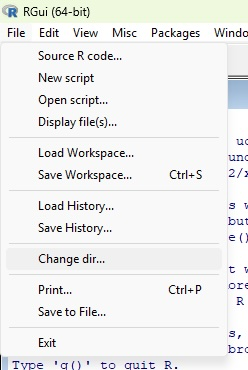
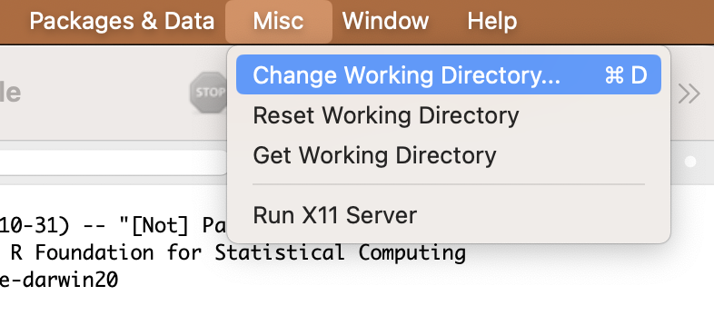
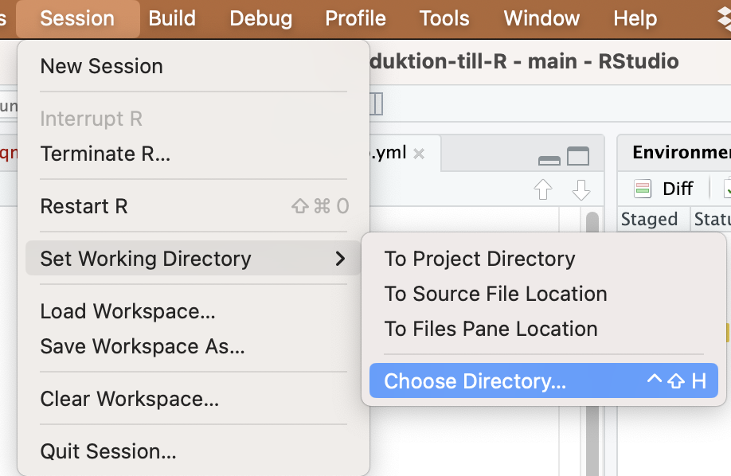
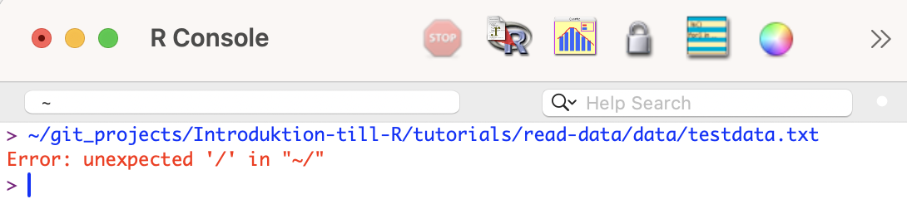
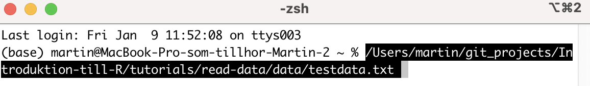

The first step, before doing a statistical analysis, is always to read the data into R.

We will go through the following:

1.  How to read data files into R

2.  An overview of common file types that R can read, described in the section on [Data formats]

## Which way should a file be read in?

There are many ways to read in a file — it partly depends on whether you use R or RStudio, but also on whether you want to document the file's name and location (recommended for reproducibility). Finally, the choice may depend on whether you are using an R project or not.

Below we will go through the following methods:

| Method | Description |
|----|----|
| [Relative path to the file] | You first specify which folder your file is in (your Working Directory) and then the file's name |
| [Absolute path to the file] | You specify exactly where the file is located on your hard drive and its name |

Which method you use is a matter of taste — both methods are common, and you should be familiar with both.

## Relative path to the file

A relative path means that you first specify which folder the file is in, and then the file's name.

Download the following file [testdata_v2.txt](data/testdata_v2.txt) (right-click, choose "Save link as") and save the file on your hard drive in a folder with a suitable name.

The next step is to tell R where on your hard drive you have saved the file, i.e. what the path is to the folder the file is in. Then you can tell R which file in that folder to read.

### Where am I?

The location you are currently in is your Working Directory, and you can decide for yourself what your Working Directory is. You probably have all the files belonging to a certain project in one folder on your hard drive, so it would make sense to set that folder as your Working Directory.

You can see where your Working Directory currently is with the function `getwd()`

Try checking where your Working Directory is

```{r}
#| code-fold: false

getwd()
```

### Change your Working Directory

A simple way to change your Working Directory is to use the menus.

Use the menus to select the folder where you saved the file `testdata_v2.txt` as your new Working Directory!

In **R** you can choose the Working Directory by clicking ***File -\> Change dir...*** in the menus (if you are using **Windows**). If the menu option doesn't appear, you may first need to click somewhere in your ***Console*** and then try again.

{fig-align="left"}

If you're using **Mac** (OSX) it looks like this:

{width="600"}

**RStudio** has a corresponding menu option:

{width="600"}

Now you have set your Working Directory so that it is the folder containing the files you want to work with!

However, it's good practice to document your Working Directory in your script, so you don't need to set it manually in the menus the next time you work with the same data. It also helps you remember where the files are located.

**After you have set the correct Working Directory in the menus, do the following:**

1.  Find out the absolute path to your Working Directory with `getwd()`. Select and copy the path.

```{r}
#| code-fold: false

getwd()
```

2.  Type (or paste) the absolute path into your script, inside the function `setwd()`

`setwd("/Users/martin/git_projects/Introduktion-till-R")`

The next time you open R and your script, it's enough to run the line with `setwd()` where you've just filled in the path to your Working Directory, and you'll land directly in your folder and be able to read in your files!

### Read in the file

Now your Working Directory is the same folder that the file `testdata.txt` is in.

We will read in the file with the function `read.table()`.

```{r}
#| code-fold: false

testdata <- read.table("testdata_v2.txt",
                     header=T,
                     sep="\t",
                     dec=",") 
```

`<-` means that we save the result of the function (here `read.table()`) in an object. Since it's our data, the object is a **dataframe**. The arrow `<-` points to the object, and we give it a suitable name, in this case `testdata`.

`read.table()` is the function for reading in text files with the `.txt` file extension

`"testdata_v2.txt"` is the path to the data file, and since it's located directly in your Working Directory, we only need to write out the name of the file (`testdata_v2.txt`).

`header=T` means that the first row of the data file is a header row and not made up of data. This is almost always the case when reading a data file into R. If the first row also consists of data (i.e. there are no headers), you replace `T` with `F` (`T` stands for TRUE, `F` stands for FALSE).

`sep="\t"` means that all values/cells are separated by TAB (it is a tab-separated text file).

`dec=","` means that a comma is used as the decimal separator (e.g. 1,32). If the file instead uses a period as the decimal separator (e.g. 1.32), you instead specify `dec="."`

## Inspect your data

The next step is to inspect your dataset, to check that everything went correctly when reading it in.

Start by inspecting the structure of the dataset with `str()`.

```{r}
#| code-fold: false

str(testdata)
```

`$ Colour: chr` means that the values in the `Colour` column are *characters*

`$ Weight: int` means that the values in the column `Weight` are *integers*

`$ Length: num` means that the values in the column `Length` are *decimal numbers* (numeric)

If you have a column that should contain decimal numbers, it should say `num`. If instead it says `chr`, it means the data file has a period as the decimal separator, but you assumed it was a comma (or vice versa), and R therefore thinks it's text. Change the separator, e.g. from `dec=","` to `dec="."` in the code and import the dataset again.

Then show the first rows of your dataset with the function `head()` and verify that everything looks correct.

```{r}
#| code-fold: false

head(testdata)
```

If everything looks correct, you're ready to analyze your data!

## Absolute path to the file {data-link="Absolute path to the file"}

An alternative is to specify the absolute path to the file, i.e. exactly where it is located on your hard drive. This is a good method to use so you always know which file you're working with, and it's advantageous if you work with files spread across different folders on your computer. It's unwise to change your Working Directory during an ongoing analysis, and it's also unwise to have more than one copy of the same file on your hard drive. To avoid that, you can use absolute paths.

**Advantage**

- Gives an absolute path (you always know exactly which file you're working with)

**Disadvantage**

- If you work with many different files that are all located in the same folder, a relative path may be more convenient

### Find out the absolute path to your data file

Download the file [testdata.txt](data/testdata.txt) (right-click, choose "Save link as") and save the file on your hard drive **in a different folder** than where you saved the file in the previous example.

The next step is to tell R where on your hard drive you have saved the file (the absolute path to the file).

### Path via `file.choose()`

The simplest way is to use the function `file.choose()`. Type in that function without filling in anything inside the parentheses. A dialog box will then appear where you locate your file and select it. R will then give you the absolute path to the file — in my case it was:

\["data/testdata.txt"\]

Select and copy the path — we'll use it when we read the file into R

### Read in the file in R {data-link="Read in the file in R"}

We will again read in the file with the function `read.table()`, and we'll call our loaded dataset `testdata_absolut`.

```{r}
#| code-fold: false

testdata_absolut <- read.table("data/testdata.txt",
                     header=T,
                     sep="\t",
                     dec=",") 
```

Note that we now have a longer path to the file.

`"data/testdata.txt"` is the path to the data file, i.e. where it is saved on your hard drive (`data/`), together with the name of the file (`testdata.txt`). You replace this text with the path to your file that you copied in the step above.

See [Read in the file in R] for our earlier description of how to interpret the different parts of the function `read.table()`. After reading in the file, you should always [Inspect your data] before starting your analyses.

```{r}
#| code-fold: false

str(testdata_absolut)
head(testdata_absolut)
```

### Path via your file manager + terminal

If you already have the file open in your file manager (Finder, Explorer or similar), an alternative way to find out the absolute path is to **drag the file and drop it into the R console**. You will then see its path, shown in **blue** on a Mac (as well as possibly some error messages, since you're doing something R doesn't understand — but R gives you the path, which is what we want).

{fig-align="left" width="600"}

The path to the file on my computer is: `~/git_projects/Introduktion-till-R/tutorials/read-data/data/testdata.txt`

**RStudio** - if you're using RStudio, dragging the file into the console doesn't work. Instead you can open your terminal (Terminal, iTerm, EMAC, MobaXterm etc.) and drop the file there. Or do it in plain R. Then you'll get a path.

{fig-align="left" width="600"}

## Data formats

R can handle a large number of data formats — some of them are read automatically, others require you to download and install specialized packages.

+-----------------------------------+--------------------------------+----------------+-------------------+--------------------------------------------------------------------------------------------------+
| File extension                    | Description                    | Function       | Extra package required | Comments                                                                                      |
+===================================+================================+================+===================+==================================================================================================+
| `txt`                             | Tab-delimited text             | `read.table()` | \-                |                                                                                                  |
+-----------------------------------+--------------------------------+----------------+-------------------+--------------------------------------------------------------------------------------------------+
| `csv`                             | Comma/semicolon-delimited text | `read.csv()`   | \-                | Specify whether the delimiter is "," or ";"                                                    |
+-----------------------------------+--------------------------------+----------------+-------------------+--------------------------------------------------------------------------------------------------+
| `xlsx`                            | Excel document                 | `read.xlsx()`  | `openxlsx`        | [See the package's documentation](https://cran.r-project.org/web/packages/openxlsx/readme/README.html) |
+-----------------------------------+--------------------------------+----------------+-------------------+--------------------------------------------------------------------------------------------------+
| `rda` `rdata`                     | R data file                    | `load()`       |                   |                                                                                                  |
+-----------------------------------+--------------------------------+----------------+-------------------+--------------------------------------------------------------------------------------------------+
| `sas7bdat` `sas7bcat` `dta` `sav` | SAS\                           | `read_sas()`\  | `haven`           | [See the package's documentation](https://haven.tidyverse.org/)                                        |
|                                   | Stata\                         | `read_dta()`\  |                   |                                                                                                  |
|                                   | SPSS                           | `read_sav()`   |                   |                                                                                                  |
+-----------------------------------+--------------------------------+----------------+-------------------+--------------------------------------------------------------------------------------------------+

: Common data types R can read (many more options exist)

We have already tried reading in a tab-delimited text file (a .txt file) in the [Read in the file](#read-in-the-file-1) section above. Now we'll try a few other file types.

## Reading in a csv file

A csv file is a file where the values are separated by commas or semicolons. It's a very common file type for long-term data storage.

Download the file [testdata_csv.csv](data/testdata_csv.csv) and save it somewhere on your hard drive.

After that, locate the file, either by using [Relative path to the file] or [Absolute path to the file]. If you saved it in the same folder as your Working Directory, it's easy to use a relative path.

### Read in the file {#read-in-the-file-1}

We will again read in the file with the function `read.csv()`. Fill in the correct path to your file

```{r}
#| code-fold: false

testdata_csv <- read.csv("data/testdata_csv.csv",
                     header=T,
                     sep=";",
                     dec=",") 
```

We save the result from the function `read.csv()`, which is a dataset, under the name `testdata_csv`. You should always use different names for different datasets.

`sep=";"` means that the values in the file are separated by semicolons. Otherwise the function works like `read.table()`, described in detail above ([Read in the file](#read-in-the-file-1)). After reading in the file, you should always [Inspect your data] before starting your analyses.

```{r}
#| code-fold: false

str(testdata_csv)
head(testdata_csv)
```

## Reading in an Excel file

Most people who collect biological data enter their values in Excel, and then export their data as a txt or csv file. It can therefore be tempting to read the Excel sheet directly into R, without taking the detour of exporting to another format.

**Advantages of reading Excel files directly**

- You only have a single file with data — there's no risk of entering new data in Excel but forgetting to export it as a txt or csv file

**Disadvantages of reading Excel files directly**

- Excel has a proprietary format; it's not guaranteed that your files can be read in the future, so it's better to save your data in an open format such as txt or csv

- It's good practice to separate your Excel files (where ongoing data collection is entered) from your finished data (your txt or csv file), which should not be manipulated

- The Excel sheet you read in must be completely clean, i.e. you must not have any cells with information other than data (for example, no charts, blank columns, or similar).

Download the file [testdata_excel.xlsx](data/testdata_excel.xlsx) and save it somewhere on your hard drive.

After that, locate the file, either by using [Relative path to the file] or [Absolute path to the file]. If you saved it in the same folder as your Working Directory, it's easy to use a relative path.

### Reading in the Excel file

To be able to read in an Excel file we need to install the package `openxlsx`. See the earlier information in the chapter on [installing packages](https://martin-lind.github.io/Introduktion-till-R/tutorials/R-packages/) for a full walkthrough of how to manage packages.

You install the package with the code `install.packages("openxlsx")`

Once the package is installed, we need to load it into our current R session

```{r}
#| code-fold: false

library(openxlsx)
```

Now the package is loaded and we can use the function `read.xlsx()` to read in our Excel file.

```{r}
#| code-fold: false

testdata_excel <- read.xlsx("data/testdata_excel.xlsx",
                     sheet=1) 
```

`sheet=1` means you read in the first sheet of the Excel document.

After reading in the file, you should always [Inspect your data] before starting your analyses.

```{r}
str(testdata_excel)
head(testdata_excel)
```
