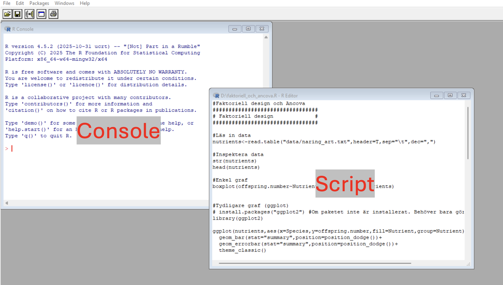
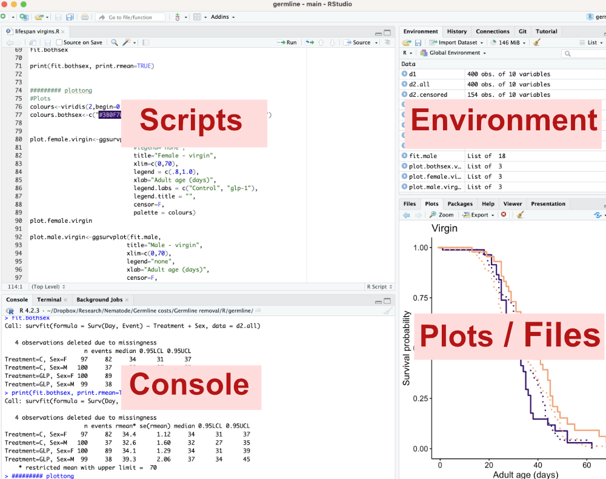
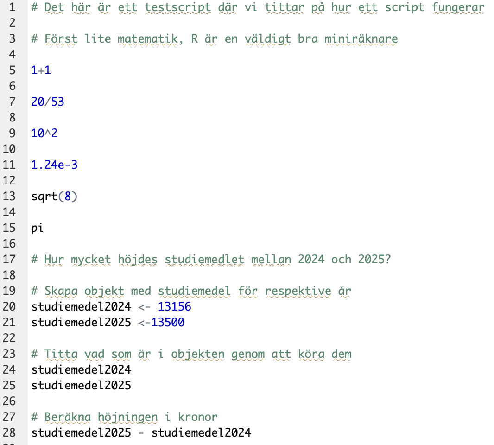

We will now open R (or RStudio), get familiar with how to write and run code, and how to use scripts.

## What R (the program) looks like

The appearance of **R** differs depending on the operating system; at startup you only see a console, and a new window opens when you open a script file. Figures end up in yet another window.

{width="1000"}

## What RStudio looks like

***RStudio*** is an alternative graphical interface (GUI) to R. Its appearance is the same regardless of operating system, and its interface is divided so that the different panes (script, console, plots, etc.) are always in the same place. The script pane is only visible once you have opened a script file.

{fig-align="left"}

## Write your first code

We will now start interacting with R, and to begin with we'll do it *interactively*, meaning we type commands directly into the console.

Click in the console, so your cursor lands on the bottom line, after the `>` sign. Type `1+1` and press Enter. When you press Enter, you run the code, i.e. what you typed on the line is read by R, and R carries out your command. In this case you're asking R to add 1 and 1, and R gives you the answer on the next line, i.e. `2`.

R is an excellent calculator, and since you can see your formula, you can easily double-check that you did it correctly. Much better than using your phone's calculator.

R can also easily handle exponents. Try typing the following:

```{r}
#| code-fold: false

10^2
```

```{r}
#| code-fold: false

1.24e-3
```

Taking the square root of a number is no problem:

```{r}
#| code-fold: false

sqrt(8)
```

R also knows mathematical constants, such as *pi*

```{r}
#| code-fold: false

pi
```

### Objects in R

R can store information in something called an **object**. An object can contain different types of information — it can be a number, a series of numbers, a name, a dataset, the result of a statistical analysis, a function, or much more. We often choose to save various results as objects so we can reuse them, but also to make our code clearer.

We will now do an exercise in using objects. The exercise is very simple and could easily be done without going through objects, but it illustrates the way of thinking and the logic of objects well.

Let's calculate how large a proportion of the EU's countries you have visited. Think about how many that is. We will then create an object we call `visited_countries`, and that object should contain a number corresponding to how many countries you have visited.

```{r}
#| code-fold: false

visited_countries <- 12
```

Let's look at the formula. `visited_countries` is the name of our object. It should be filled with content. You want to fill it with the number of EU countries you have visited. So you type `<-`, which is an arrow pointing at the object. After the arrow you type the number of countries you've visited, for example `12`. The arrow goes from the number 12 to our object, i.e. you save the number 12 into our object.

If you want to see what an object contains, you type the object's name and press Enter.

```{r}
#| code-fold: false

visited_countries
```

To calculate the proportion of EU countries you've visited, we need to make an object we call `total_countries`, containing the number of countries that are members of the EU

```{r}
#| code-fold: false

total_countries <- 27
```

Now we can calculate the proportion of EU countries you've visited, by dividing the object `visited_countries` by `total_countries`

```{r}
#| code-fold: false

visited_countries / total_countries
```

Maybe you'd rather have it as a percentage? Modify the formula!

```{r}
#| code-fold: false

visited_countries / total_countries * 100
```

You might want to use this result in future calculations and want it saved as an object. Modify the latest formula so that you save the result as an object you call `percent_EUcountries_visited`

```{r}
#| code-fold: false

percent_EUcountries_visited <- visited_countries / total_countries * 100
```

Check what the object `percent_EUcountries_visited` contains by typing its name and pressing Enter

```{r}
#| code-fold: false

percent_EUcountries_visited
```

### Functions in R

Do you think R shows an unnecessarily large number of decimals? If you use the function `round()` you can decide how many decimals R should show. Let's express the percentage in the object `percent_EUcountries_visited` with one decimal

```{r}
#| code-fold: false

round(percent_EUcountries_visited, digits = 1)
```

A **function** is an operation built into R. The function has a name (in this case `round`) and is always followed by parentheses. Inside the parentheses you specify the object R should do something with, as well as any other parameters that need to be given. If you use `round()` you must specify how many decimals R should round to, `digits = 1`. Try changing the value to get a different number of decimals!

If you don't know how a function works, you can always access R's help files by typing a question mark followed by the function's name, and pressing Enter. Try it!

`?round`

Let's try a few functions to get summary statistics on a set of values, which we save in an object we call `counts`

```{r}
#| code-fold: false

counts <- c(3,6,5,8,4,6,2,4,6,4,5,3,9,10,2,5,7,6)
```

Let's calculate the mean of `counts`, using the function `mean()`

```{r}
mean(counts)
```

What is the standard deviation? We use the function `sd()`

```{r}
sd(counts)
```

How many values do we have in our variable `counts`? Use the function `length()`

```{r}
length(counts)
```

What is the standard error (SE)? The standard error is the standard deviation divided by the square root of the number of measurements. We've used all these functions already, so try writing your own code to calculate the standard error. If you get stuck, the code is below.

```{r}
sd(counts) / sqrt(length(counts))
```

When we do statistics, we constantly use R's various functions to read in data, make graphs, run statistical tests, and give us the results of the tests. It is all these built-in statistical functions that make R a leading language for statistical computing, and even more functions are available in the thousands of packages you can install in R.

## Using script files

So far you have interacted with R interactively, meaning we've asked R to do something, R has done it, we've asked R to do something new, R has done that too, and so on. It's a bit like a conversation with another person.

The downside of working interactively is the same as the downside of a spoken conversation. For one thing, it's hard to remember what was said when you think back on it later, and it's also difficult to do complicated tasks unless you start writing down what you're doing.

How do we remember our conversation with R — what we've done and what we've found? We use script files!

### What is a script file?

A script file is a document with the extension `*.R` where you document the commands you give to R in a logical order. You can also add comments to your script explaining what you've done (this is called *annotating* the script).

Since R always gives the same answer to your commands (unless you ask R to do something involving random numbers), it's enough to document the commands you give to R. You can then run your commands again and get the answer again.

### Advantages of script files

-   You document what you do, and can repeat your analysis in the future

-   If you're going to do a new analysis on a new dataset, but with methods you've previously used and documented in a script, you can copy your existing script and only change what's needed for your new data. You don't have to start from scratch. Your old scripts are therefore a goldmine when you're about to analyze new data.

-   You can more easily debug code and develop analyses that happen in several steps

-   You can easily go back and change some step in an analysis

To sum up: there are no downsides to using script files instead of running R interactively. Only advantages. The only times I use R interactively myself are when I use R as a calculator for everyday problems.

## What does a script file look like?

We start by downloading an existing script file: [testscript.R](scripts/testscript.R) (right-click, choose "Save link as") and save it somewhere suitable on your hard drive. Then choose **file -\> open document** in R, or **file -\> open file** in RStudio. The script file now opens as a new window (in R) or in the upper left part of the program (in RStudio).

Let's take a look at the script

{fig-align="left" width="600"}

### Comments (annotations)

We see that the first line starts with a hashtag (`#`).

`# This is a test script where we look at how a script works`

This means the line is not interpreted as code, but as a comment on your code. A file that only contains code but no comments is fairly incomprehensible, even to yourself when you return to the script a few days later. We use comments to document:

1.  What we're doing

2.  Why we're doing it

A well-documented script file (also called a *well-annotated script file*) is easy to return to in order to repeat the analyses or apply them to new datasets. If you use RStudio, comments are automatically colored differently.

### Code in script files

The first line that doesn't start with a `#` is the line that reads: `1+1`

That is a line of code. In our script we have documented our question to R: "what is 1+1?" But we don't yet have an answer from R. We have documented the question, but not yet asked it. We need to **run that line in the script** for R to give us an answer.

In principle you could select the line, copy the code, and paste it into the console (keep that as a backup solution if you forget how to do it), but it's much more convenient to do the following:

**Select the code you want to run** and:

-   press **command + Enter** (on Mac)

-   press **ctrl + r** (on Windows)

Run the line with the code `1+1` following the instructions above:

```{r}
1+1
```

Once you've run the line, it appears in the console, and on the line below you get the answer from R.

### Run code in the right order

The line of code we ran doesn't contain any objects, so it can be run independently of other lines. But try running the line: `studiemedel2025 - studiemedel2024`

Do you get an error message? `Error: object 'studiemedel2025' not found`

That means you're asking R to do something with an object, but R doesn't know what that object is. You documented the creation of the object in your script a few lines above:

```{r}
#| code-fold: false

# Create objects with the student aid amount for each year
studiemedel2024 <- 13156
studiemedel2025 <-13500
```

You must first run those lines, so that R knows what the objects `studiemedel2024` and `studiemedel2025` contain. Then you can run the line `studiemedel2025 - studiemedel2024` again. It should work then!

```{r}
#| code-fold: false

# Calculate the increase in kronor
studiemedel2025 - studiemedel2024
```

## Write your first script

Now let's try writing our own script! We start by creating a script file by clicking through the menus:

-   R: choose **File \> New document**

-   RStudio: choose **File \> New file \> R Script**

*Your task is the following:* Create a script that calculates how old a person turns this year (for example, how old you turn this year). Use our script about the student-aid increase above as a source of inspiration, and comment your script well.

Try it yourself, but if you get stuck you can peek at a possible solution below (under Code).

```{r}
# A script to calculate how old a person turns this year

# Specify what year it is now
year_now <- 2026

# Specify when the person was born
year_born <- 1998

# Calculate how old the person turns this year

year_now - year_born
```

Don't forget to **save your script with a suitable name** on your hard drive. In R you must type the file extension .R yourself when you save the script the first time, while RStudio adds that extension automatically.
